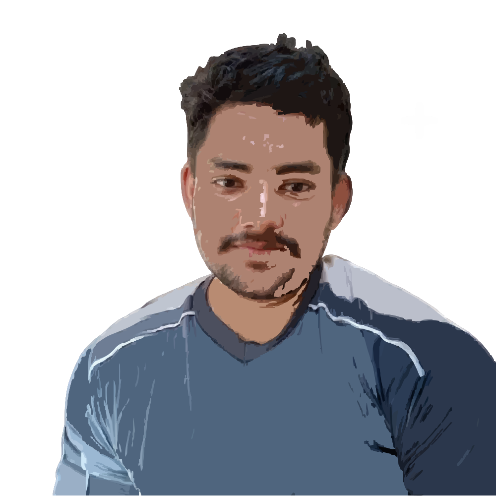

#  Muhammad Adnan – Developer Portfolio

Hey 👋 I’m **Muhammad Adnan**. A **full-stack developer** passionate about building **clean**, **fast**, and **user-friendly** digital experiences.
This is my personal portfolio showcasing my **work**, **skills**, and **ways to connect** with me.


## ✨ Features

* ⚡ **Ultra-fast** development & build with [Vite](https://vitejs.dev/)
* 📱 **Responsive** design for mobile, tablet, and desktop
* 🔍 **SEO-ready** with meta tags, sitemap & robots.txt
* 🎨 **Minimal & modern UI** powered by Tailwind CSS

---

## 🛠 Tech Stack

**Core:** React · Vite · Tailwind CSS · React Router
**UI & Icons:** Lucide Icons

---

## 🚀 Quick Start

Clone the repository:

```bash
git clone https://github.com/oymusafir/myportfolio.git
```

Navigate into the folder:

```bash
cd myportfolio
```

Install dependencies:

```bash
npm install
```

Start the development server:

```bash
npm run dev
```

---

## 📬 Contact Me

If you’re interested in working together or just want to connect:

* **Website**: [muhammadadnan.dev](https://muhammadadnan.dev)
* **Email**: [oymusafir@email.com](mailto:oymusafir@email.com)
* **LinkedIn**: [linkedin.com/in/oymusafir](https://linkedin.com/in/oymusafir)
* **GitHub**: [github.com/oymusafir](https://github.com/oymusafir)
* **WhatsApp**: [wa.me/923424590618](https://wa.me/923424590618) 
---

## 📜 License

This project is licensed under the **MIT License** — feel free to fork and customize.

